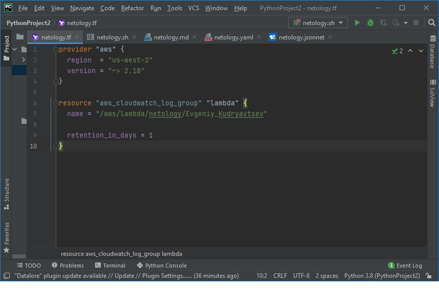

## Домашнее задание по лекции "Введение в DevOps"

1. Скриншоты:
   
   
   
   
   
   
   
1. Описание жизненного цикла задачи (разработки нового функционала)
   - Планирование разработки задачи. (менеджеры, devops)
   - Разработка нового функционала, использование идентичных сред при разработке, на серверах тестирования, production-серверах, написание тестов (разработчики, devops)
   - Тестирование кода нового функционала, контроль написания тестов, максимальная автоматизация тестирования, мониторинг тестирования. (тестировщики, devops)
   - Проверка, тестирование работы нового функционала в песочнице, одобрение менеджерами. Автоматизация создания, уничтожения песочниц. (менеджеры, devops)
   - Выкладка в продакшн с возможностью отката изменений, автоматизация процесса, мониторинг ошибок в работе приложения, логирование и авто-оповещение об ошибках, использование систем контроля версий, обратная связь с конечными пользователями (менеджеры, devops)